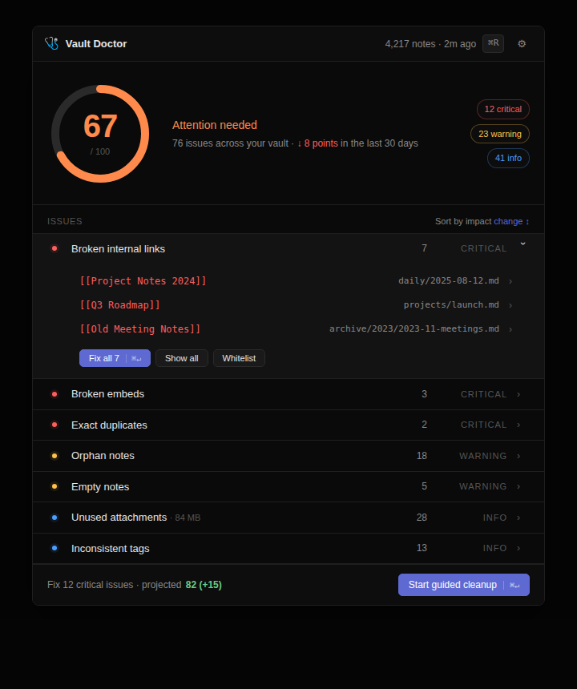

# Vault Doctor

> Audit + auto-cleanup plugin for Obsidian. **Work in progress.**

[](LICENSE)
[](#status)
[](https://obsidian.md)
[](https://github.com/itzenata/vault-doctor/stargazers)
[](https://github.com/itzenata/vault-doctor/commits/main)

🌐 **Landing page:** [itzenata.github.io/vault-doctor](https://itzenata.github.io/vault-doctor/)

## Status

🟡 **Pre-alpha** — design phase, scaffolding the plugin code now.



*Static preview of the planned dashboard — see [`mockup.html`](./mockup.html) for the live version.*

## What it will do

A vault-wide scan producing a health score (0–100) and one-click corrective actions for broken links, orphan notes, duplicates, ghost attachments, and inconsistent tags.

**Hard rules:** local-first (no network), dry-run by default, no real `delete` (system trash only).

## Progress

- [x] Public spec, MIT-licensed
- [x] Dashboard mockup ([live](./mockup.html) · [PNG](./mockup.png))
- [x] [Landing page](https://itzenata.github.io/vault-doctor/) on GitHub Pages
- [x] [Issue templates](.github/ISSUE_TEMPLATE) for bugs, features, and rule suggestions
- [ ] Reddit r/ObsidianMD validation post
- [ ] MVP scan engine + 5 core detection rules
- [ ] First installable build
- [ ] Community plugin store submission

## Get involved

- ⭐ Star to follow progress
- 💡 [Suggest a detection rule](https://github.com/itzenata/vault-doctor/issues/new?template=rule_suggestion.md) — feedback now shapes the rule priorities
- 💬 [Open an issue](https://github.com/itzenata/vault-doctor/issues/new/choose) for any vault hygiene problem you'd want solved

## Development (work in progress)

```bash
npm install
npm run dev      # esbuild watch mode → main.js
npm run build    # production bundle + typecheck
```

The plugin is not yet installable. Code lives at the repo root (`main.ts`, `src/`).

License: [MIT](./LICENSE)
